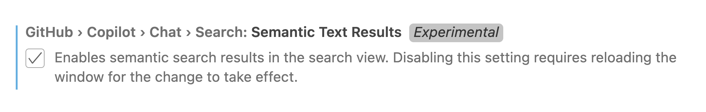

# Neurd 🧠

An adaptable note-taking journal built with AI in mind.

## Quickstart

Clone the Neurd template repo and then copy any of the templates from the `/templates` folder into the corresponding folder in the `/content` folder. For example, to add a new daily journal entry, copy the `daily.md` template into a new file in `/content/daily`.

## Usage

Using Neurd Notes is relatively straightforward. Add new files to the `daily`, `weekly`, and `notes` directories and then use an integration or the Neurd tools to interact with your content later.

> [!TIP]
> Toggle [Zen Mode](https://code.visualstudio.com/docs/getstarted/userinterface#_zen-mode) in VS code for a distraction-free note taking experience

## Tools

- Neurd VS Code Extension: Commands to quickly create daily, weekly, and one-off note files. Chat participant to chat with content inside VS Code.
- Neurd CLI: CLI for generating new files, searching knowledge base, and chatting with content

## Content Management

### Private Notes

The [.gitignore](.gitignore) file included in the template repo is set up to ignore all content in the `/content/private` directory. 

## Integrations

Neurd notes are designed to be used alongside AI tools. Some AI tools enable you to chat with your content while others can help you search it. Below are instructions for integrating with popular AI tools.

### VS Code Copilot Fuzzy Search

You can enable the fuzzy/semantic search feature in VS code by toggling the `github.copilot.chat.search.semanticTextResults` experimental setting.



With this turned on, a new section called "GitHub Copilot Results" will appear in the search sidebar. This should let you search your entire Neurd journal without needing exact search terms.

### LlamaIndex Integration

LlamaIndex is a framework for building LLM-powered agents over your data. One of the most useful aspects of the framework is the [RAG CLI](https://docs.llamaindex.ai/en/stable/getting_started/starter_tools/rag_cli/) which lets you chat with an LLM about the files you have saved locally on your computer.

1. Install the libraries

```bash
pip install -U llama-index
pip install -U chromadb
```

2. Set your OPENAI_API_KEY

```bash
export OPENAI_API_KEY=<api_key>
```

3. Ingest some files

To chat with all of the notes in your Neurd journal, run the following command at the root of your project:

```bash
llamaindex-cli rag --files "./content"
```

4. Ask a question

Once the index is finished building, ask a question:

```bash
llamaindex-cli rag --question "What is LlamaIndex?"
```